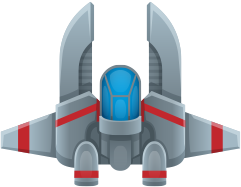
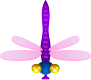

# SDL Shooter - 2D 太空射击游戏

<p align="center">
  
  
  
</p>

<p align="center">
  <em>一款基于 C++17 和 SDL2 构建的 2D 太空射击游戏，具有自动攻击、动态追踪敌人、道具系统和大招机制等特色玩法。</em>
</p>

## 📖 项目简介

《SDL Shooter》是一款 2D 太空射击游戏，玩家驾驶飞船在太空中与各种敌人战斗。游戏采用基于场景的架构设计，包含标题界面、主游戏场景和结算界面，实现了玩家/敌人战斗、道具增益、大招系统以及视差背景滚动效果。

### 🎮 核心特色
- **自动攻击系统**：玩家无需按键即可自动发射子弹，专注于移动和策略
- **动态敌人追踪**：所有敌人实时追踪玩家位置，计算角度朝向
- **多样化敌人类型**：普通敌人、自爆敌人、Boss战（每500分召唤）
- **道具增益系统**：生命、护盾、子弹、能量四种增益道具
- **大招机制**：收集3个能量释放无敌技能，持续5秒
- **护盾优先机制**：护盾优先承受伤害，保护生命值
- **玩家成长系统**：每100分提升最大生命值，随分数成长
- **动态难度调整**：Boss血量随玩家分数增长而提升

## 🚀 快速开始

### 系统要求
- **操作系统**：Windows 10/11
- **编译器**：支持 C++17 的编译器（如 MSVC、GCC、Clang）
- **构建工具**：CMake 3.10+
- **依赖库**：SDL2、SDL2_image、SDL2_mixer、SDL2_ttf

### 构建项目
```bash
# 克隆仓库
git clone https://github.com/your-username/SDLShooter.git
cd SDLShooter

# 使用 CMake 预设构建（推荐）
cmake --preset "Visual Studio 生成工具 2022 Release - amd64"
cmake --build --preset "Visual Studio 生成工具 2022 Release - amd64-debug"

# 或者使用 VS Code
# 1. 打开项目文件夹
# 2. 执行「CMake: build」任务（快捷键 Ctrl+Shift+B）
```

### 运行游戏
```bash
# 构建完成后，运行可执行文件
./bin/Debug/SDLShooter-Windows.exe
```

## 🎯 游戏控制

### 移动控制
| 按键 | 功能 |
|------|------|
| **W** | 向上移动 |
| **S** | 向下移动 |
| **A** | 向左移动 |
| **D** | 向右移动 |
| **空格 (Space)** | 加速移动（1.5倍速度） |

### 战斗控制
| 按键 | 功能 |
|------|------|
| **J** | 手动发射子弹（已改为自动攻击，此键保留） |
| **K** | 释放大招（需能量充满） |

### 其他控制
| 按键 | 功能 |
|------|------|
| **ESC** | 退出游戏 |

## 🎮 游戏玩法

### 游戏目标
控制飞船在太空中生存，击败尽可能多的敌人获得高分。每500分会召唤强力Boss，击败Boss获得大量分数。

### 玩家属性
| 属性 | 初始值 | 最大值 |
|------|--------|--------|
| 生命值 | 3 | 无上限（每100分+1） |
| 护盾值 | 0 | 无限制 |
| 子弹数量 | 1 | 50 |
| 能量值 | 0 | 3 |
| 移动速度 | 300 | - |

### 敌人类型
1. **普通敌人**
   - 生命值：2
   - 移动速度：150
   - 射击冷却：1秒
   - 击杀奖励：+10分，50%概率掉落道具

2. **自爆敌人**
   - 生命值：2
   - 移动速度：100
   - 自爆倒计时：3秒（接近玩家时触发）
   - 爆炸范围：敌机尺寸的3倍
   - 爆炸伤害：2点
   - 击杀奖励：+15分，50%概率掉落道具

3. **Boss敌人**（每500分召唤）
   - 血量公式：0.003 × 分数^(3/2)
   - 移动速度：80
   - 攻击模式：每5秒切换（散弹/环形弹幕）
   - 击杀奖励：Boss血量的10%

### 道具系统
| 道具 | 效果 | 掉落概率 |
|------|------|----------|
| 生命恢复 | 生命值 +1（不超过最大值） | 30% |
| 护盾 | 护盾值 +1 | 20% |
| 子弹增强 | 子弹数 +1（不超过50） | 30% |
| 能量 | 能量值 +1（不超过3） | 20% |

**拾取规则**：所有被击杀的敌人有50%概率掉落道具，拾取道具额外获得+5分。

### 计分规则
| 行为 | 分数 |
|------|------|
| 击杀普通敌人 | +10 |
| 击杀自爆敌人 | +15 |
| 击败Boss | Boss血量的10% |
| 拾取道具 | +5 |

## 📁 项目结构

```
SDLShooter/
├── .vscode/                 # VS Code 配置文件
├── assets/                  # 游戏资源文件
│   ├── effect/             # 特效
│   ├── font/               # 字体文件 (VonwaonBitmap)
│   ├── image/              # 图像资源 (飞船、敌人、子弹等)
│   ├── music/              # 背景音乐 (.ogg格式)
│   └── sound/              # 音效文件 (.wav格式)
├── bin/                    # 编译输出目录
├── build/                  # CMake 构建目录
├── include/                # 头文件目录
├── out/                    # 安装输出目录
├── src/                    # 源代码目录
├── .gitignore             # Git 忽略文件
├── CMakeLists.txt         # CMake 构建配置文件
├── CMakePresets.json      # CMake 预设配置
├── CODEBUDDY.md           # 开发指引文档
├── GAME_RULES.md          # 详细的游戏规则说明书
├── LICENSE.md             # MIT 许可证
└── README.md              # 项目说明文档 (本文件)
```

### 核心代码文件
- **`src/main.cpp`** - 程序入口
- **`include/Game.h`, `src/Game.cpp`** - 游戏单例类，管理主循环和场景切换
- **`include/IScene.h`** - 场景抽象接口
- **`include/Object.h`** - 游戏对象定义（玩家、敌人、子弹、道具等）
- **`include/SceneTitle.h`, `src/SceneTitle.cpp`** - 标题场景
- **`include/SceneMain.h`, `src/SceneMain.cpp`** - 主游戏场景
- **`include/SceneResult.h`, `src/SceneResult.cpp`** - 结算场景
- **工具组件**：
  - `AngleCalculator` - 角度计算工具
  - `HealthSystem` - 生命值和护盾管理系统
  - `SoundManager` - 音效管理器（单例）
  - `TextureManager` - 纹理管理器（单例）
  - `EntityManager` - 通用实体管理器模板类

## 🔧 构建与开发

### 依赖项
- **C++17** 标准
- **SDL2** - 图形渲染、窗口管理、输入处理
- **SDL2_image** - PNG 图片加载
- **SDL2_mixer** - 音频播放（背景音乐和音效）
- **SDL2_ttf** - TrueType 字体渲染

### 构建配置
项目使用 **CMake 3.10+** 作为构建系统，预设使用 **Visual Studio 2022** 编译器。

**主要配置**：
- 目标可执行文件：`SDLShooter-Windows.exe`
- 调试版输出：`bin/Debug/SDLShooter-Windows.exe`
- 发布版输出：`bin/Release/SDLShooter-Windows.exe`
- C++ 标准：C++17

### 开发环境设置
1. **安装依赖库**：
   - SDL2、SDL2_image、SDL2_mixer、SDL2_ttf
   - 推荐安装到 `C:/Users/<用户名>/.cmake/` 目录

2. **配置 VS Code**：
   - 打开项目文件夹
   - 安装 C/C++ 扩展
   - 使用预设的构建任务和调试配置

3. **构建与调试**：
   - **构建**：`Ctrl+Shift+B` 执行 CMake 构建任务
   - **调试**：F5 启动调试（使用 "MSVC Debug" 配置）

## 📚 相关文档

- **[GAME_RULES.md](GAME_RULES.md)** - 详细的游戏规则说明书，包含操作、角色属性、游戏机制、技巧等完整信息
- **[CODEBUDDY.md](CODEBUDDY.md)** - 开发指引文档，包含架构设计、核心组件说明、资源文件结构等
- **[LICENSE.md](LICENSE.md)** - MIT 许可证文件

## 📝 设计模式

项目采用了多种设计模式以提高代码的可维护性和可扩展性：

- **单例模式**：`Game` 类、`SoundManager`、`TextureManager`
- **场景模式**：基于 `IScene` 接口的场景管理系统
- **组件化实体**：基于结构体的游戏对象设计
- **模板设计**：`EntityManager` 支持多种实体类型
- **资源管理**：SDL 负责纹理、音频、字体的生命周期管理

## 📦 打包与分发

### 生成安装包
项目支持使用 **CPack + NSIS** 生成专业的 Windows 安装包。

#### 快速开始
```bash
# 使用提供的打包脚本（最简单）
scripts\package.bat

# 或手动构建
cmake -B build -S . -G "Visual Studio 17 2022" -A x64 -DCMAKE_BUILD_TYPE=Release
cmake --build build --config Release
cd build && cpack -C Release
```

#### 安装包内容
生成的安装包 (`SDLShooter-0.1.0-win64.exe`) 包含：
- 游戏可执行文件
- SDL2 运行时库（SDL2.dll, SDL2_image.dll 等）
- 所有游戏资源文件（图像、音频、字体）
- 自动安装 Visual C++ Redistributable
- 开始菜单快捷方式和卸载程序

#### 详细文档
详见 [PACKAGING.md](PACKAGING.md) 获取完整的打包指南。

## 🎵 资源文件

### 图像资源 (`assets/image/`)
- `SpaceShip.png` - 玩家飞船
- `insect-2.png` - 普通敌机
- `insect-1.png` - 自爆敌机
- `laser-1.png` - 玩家子弹
- `laser-2.png` - 敌机子弹
- `explosion.png` - 爆炸效果
- `Stars-A.png`, `Stars-B.png` - 视差背景
- 各种 UI 元素和道具图标

### 音频资源
- **背景音乐**：`assets/music/03_Racing_Through_Asteroids_Loop.ogg`
- **音效**：`assets/sound/` 目录包含射击、爆炸、击中、拾取等音效

### 字体文件
- `VonwaonBitmap-16px.ttf` - 标题字体
- `VonwaonBitmap-12px.ttf` - UI 字体

## 📄 许可证

本项目采用 **MIT 许可证** - 详见 [LICENSE.md](LICENSE.md) 文件。

```
Copyright (c) 2025-2026 Tangchuan

Permission is hereby granted, free of charge, to any person obtaining a copy
of this software and associated documentation files (the "Software"), to deal
in the Software without restriction, including without limitation the rights
to use, copy, modify, merge, publish, distribute, sublicense, and/or sell
copies of the Software, and to permit persons to whom the Software is
furnished to do so, subject to the following conditions:

The above copyright notice and this permission notice shall be included in all
copies or substantial portions of the Software.

THE SOFTWARE IS PROVIDED "AS IS", WITHOUT WARRANTY OF ANY KIND, EXPRESS OR
IMPLIED, INCLUDING BUT NOT LIMITED TO THE WARRANTIES OF MERCHANTABILITY,
FITNESS FOR A PARTICULAR PURPOSE AND NONINFRINGEMENT. IN NO EVENT SHALL THE
AUTHORS OR COPYRIGHT HOLDERS BE LIABLE FOR ANY CLAIM, DAMAGES OR OTHER
LIABILITY, WHETHER IN AN ACTION OF CONTRACT, TORT OR OTHERWISE, ARISING FROM,
OUT OF OR IN CONNECTION WITH THE SOFTWARE OR THE USE OR OTHER DEALINGS IN THE
SOFTWARE.
```

## 🤝 贡献

欢迎提交 Issue 和 Pull Request 来改进这个项目！

## 📧 联系

如有问题或建议，请通过 GitHub Issues 联系。

---

<p align="center">
  <em>祝您游戏愉快！ 🚀✨</em>
</p>